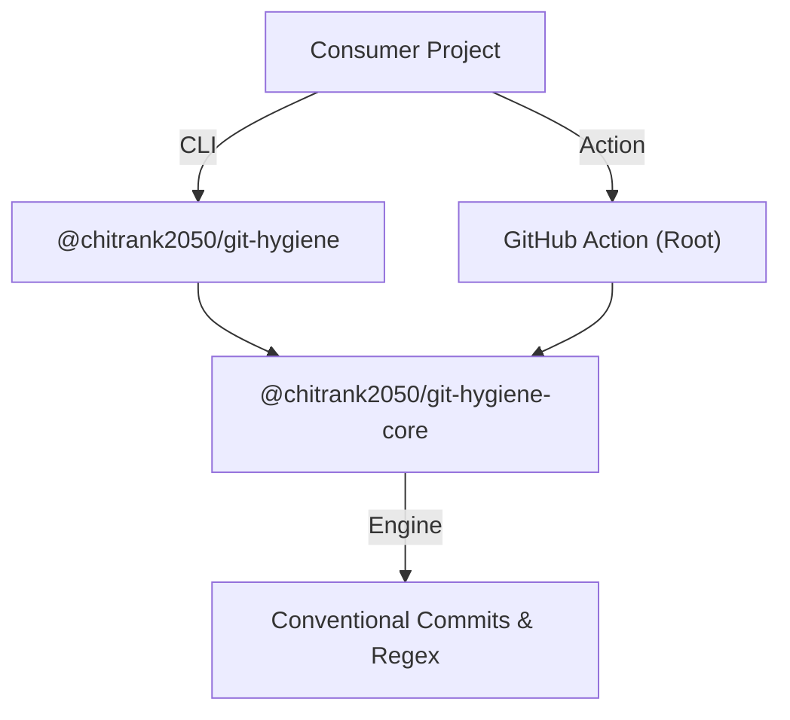

<div align="center">
  

  <h1>git-hygiene 🌊</h1>
  <p>The ultimate zero-dependency metadata validator for modern Git workflows.</p>

  <p>
  <a href="https://www.npmjs.com/package/@chitrank2050/git-hygiene">
    
  </a>
  <a href="https://jsr.io/@chitrank2050/git-hygiene">
    
  </a>
  <a href="https://github.com/marketplace/actions/git-hygiene-validator">
    
  </a>
  <br/>
  <br/>
  <a href="https://github.com/chitranklabs/git-hygiene/actions/workflows/ci.yml">
    
  </a>
  <a href="https://bestpractices.coreinfrastructure.org/projects/1">
    
  </a>
  <a href="https://github.com/chitranklabs/git-hygiene/actions/workflows/scorecard.yml">
    
  </a>
  <a href="https://scorecard.dev/viewer/?uri=github.com/chitranklabs/git-hygiene">
    
  </a>
  <a href="https://codecov.io/gh/chitranklabs/git-hygiene">
    
  </a>
  <a href="./LICENSE">
    
  </a>

[Features](#features) • [Installation](#installation) • [Usage](#usage) • [Architecture](#architecture) • [Contributing](#contributing)

  <br/>
</div>

`git-hygiene` is a high-performance, **zero-dependency** engine designed to enforce perfect metadata across your entire Git lifecycle. Built natively for **Node.js 24+**, it validates Conventional Commits, branch naming patterns, and Pull Request titles with microsecond startup times.

---

## 📦 Registries & Links

| Registry        | Package                          | URL                                                                                                                  |
| :-------------- | :------------------------------- | :------------------------------------------------------------------------------------------------------------------- |
| **NPM**         | `@chitrank2050/git-hygiene`      | [npmjs.com/package/@chitrank2050/git-hygiene](https://www.npmjs.com/package/@chitrank2050/git-hygiene)               |
| **JSR**         | `@chitrank2050/git-hygiene`      | [jsr.io/@chitrank2050/git-hygiene](https://jsr.io/@chitrank2050/git-hygiene)                                         |
| **Marketplace** | `git-hygiene-validator`          | [github.com/marketplace/actions/git-hygiene-validator](https://github.com/marketplace/actions/git-hygiene-validator) |
| **Core (NPM)**  | `@chitrank2050/git-hygiene-core` | [npmjs.com/package/@chitrank2050/git-hygiene-core](https://www.npmjs.com/package/@chitrank2050/git-hygiene-core)     |
| **Core (JSR)**  | `@chitrank2050/git-hygiene-core` | [jsr.io/@chitrank2050/git-hygiene-core](https://jsr.io/@chitrank2050/git-hygiene-core)                               |

---

## Features <a id="features"></a> ✨

| Feature                       | Description                                                                 |
| ----------------------------- | --------------------------------------------------------------------------- |
| 🧼 **Unified Engine**         | Define your standards once. Enforce them in commits, branches, and PRs.     |
| ⚡ **Zero Dependencies**      | Built using native Node.js APIs. No `commander`, `yargs`, or `chalk` bloat. |
| 🛡️ **Hardened Security**      | 100% SHA-pinned workflows & OpenSSF Scorecard verified.                     |
| 📦 **Universal Distribution** | Native support for **NPM**, **JSR**, and **GitHub Actions**.                |
| 🧠 **Context Aware**          | Automatically detects `.git` environment and CI context.                    |

---

## Installation <a id="installation"></a> 📦

```bash
# Using pnpm (Recommended)
pnpm add -D @chitrank2050/git-hygiene

# Using npm
npm install --save-dev @chitrank2050/git-hygiene
```

---

## Usage <a id="usage"></a> 🛠️

### 1. Local Hooks (Lefthook)

The recommended way to use `git-hygiene` locally.

```yaml
# lefthook.yml
commit-msg:
  commands:
    hygiene:
      run: npx @chitrank2050/git-hygiene commit {1}

pre-push:
  commands:
    hygiene:
      run: npx @chitrank2050/git-hygiene branch
```

### 2. Local Hooks (Husky)

For projects using Husky 9+.

```bash
# .husky/commit-msg
npx @chitrank2050/git-hygiene commit $1

# .husky/pre-push
npx @chitrank2050/git-hygiene branch
```

### 3. GitHub Actions (CI)

Validate PR metadata natively. We recommend pinning to a specific SHA.

```yaml
# Validate PR Title
- name: Validate PR Title 🏷️
  uses: chitranklabs/git-hygiene@<SHA>
  with:
    command: 'title'
    value: '${{ github.event.pull_request.title }}'

# Validate Branch Name
- name: Validate Branch Name 🌿
  uses: chitranklabs/git-hygiene@<SHA>
  with:
    command: 'branch'
    value: '${{ github.head_ref }}'
```

### 4. Manual / Script Usage

Run any check manually from the terminal.

```bash
# Check a specific commit message
npx @chitrank2050/git-hygiene commit --value "feat: my awesome commit"

# Check a branch name string
npx @chitrank2050/git-hygiene branch "feature/cool-stuff"

# Check a PR title
npx @chitrank2050/git-hygiene title "fix(core): resolve memory leak"
```

---

## 🐙 GitHub Action

You can easily integrate `git-hygiene` into your CI/CD pipeline using the official GitHub Action. This allows you to validate PR titles, branch names, and commit messages automatically.

### Usage Example

```yaml
jobs:
  hygiene:
    runs-on: ubuntu-latest
    steps:
      - name: Validate PR Title 🌊
        uses: chitranklabs/git-hygiene@<SHA>
        with:
          command: 'title'
          value: ${{ github.event.pull_request.title }}
```

> **Note on Pinning to a SHA:** For maximum security and stability, we highly recommend pinning the `uses` directive to a specific commit SHA instead of a branch like `@main`. You can get the commit SHA by navigating to the [Commits page](https://github.com/chitranklabs/git-hygiene/commits/main) of this repository and copying the 40-character hash (e.g. `uses: chitranklabs/git-hygiene@8f3d...`).

---

### 5. Programmatic Usage (Library)

Import the engine directly into your TypeScript project.

```typescript
import { validateBranch } from '@chitrank2050/git-hygiene-core';

const { valid, error } = validateBranch('feat/new-ui');
```

---

## Configuration <a id="configuration"></a> ⚙️

`git-hygiene` is designed to be zero-config, but you can easily customize the engine by adding a `git-hygiene` block to your root `package.json`.

### Reference Table

| Property          | Description                               | Default                                     | Possible Values                                |
| ----------------- | ----------------------------------------- | ------------------------------------------- | ---------------------------------------------- |
| `types`           | Allowed commit types                      | `feat`, `fix`, `chore`, etc.                | `string[]`                                     |
| `ignoreBranches`  | Branches to skip validation (e.g. `main`) | `main`, `master`, `development`, `gh-pages` | `string[]`                                     |
| `maxHeaderLength` | Max length of the commit header           | `100`                                       | `number`                                       |
| `maxBodyLength`   | Max length of a single body line          | `1000`                                      | `number`                                       |
| `minBodyLength`   | Min length of the commit body             | `0`                                         | `number`                                       |
| `typeCase`        | Case requirement for types                | `lower-case`                                | `lower-case`, `upper-case`, `camel-case`, etc. |
| `scopeCase`       | Case requirement for scopes               | `lower-case`                                | `lower-case`, `upper-case`, `camel-case`, etc. |
| `allowEmptyScope` | Whether scope is optional                 | `true`                                      | `boolean`                                      |
| `subjectFullStop` | Whether subject can end with a period     | `never`                                     | `always`, `never`                              |
| `extends`         | Standard configs to extend from           | `[]`                                        | `['@commitlint/config-conventional']`          |
| `rules`           | Raw commitlint rules to merge/override    | `{}`                                        | `Record<string, any>`                          |

### Example `package.json`

```json
{
  "git-hygiene": {
    "extends": ["@commitlint/config-conventional"],
    "types": ["feat", "fix", "chore", "docs", "refactor", "test", "renovate"],
    "ignoreBranches": ["main", "develop", "release/*"],
    "maxHeaderLength": 100,
    "allowEmptyScope": false
  }
}
```

---

## Architecture <a id="architecture"></a> 🏛️



---

## 🙏 Credits

`git-hygiene` stands on the shoulders of giants. Special thanks to:

- **[commitlint](https://commitlint.js.org/)**: For the industry-standard commit validation logic we use under the hood.

---

## Contributing <a id="contributing"></a> 🤝

We ❤️ contributions! Whether you're fixing a bug, adding a feature, or improving documentation, please see our [Contributing Guide](./CONTRIBUTING.md) to get started.

---

## Community & Support 🌏

- **Security**: Please see our [Security Policy](./SECURITY.md) for reporting vulnerabilities.
- **Conduct**: We follow the [Contributor Covenant Code of Conduct](./CODE_OF_CONDUCT.md).
- **Support**: If you use `git-hygiene` in your project, a star or credit is appreciated. ✨

---

## 📜 License

MIT - see [LICENSE](LICENSE) for details.

If you use `git-hygiene` in your project, a star or credit is appreciated. ✨

---

❤️ Developed by [Chitrank Agnihotri](https://www.chitrankagnihotri.com)
